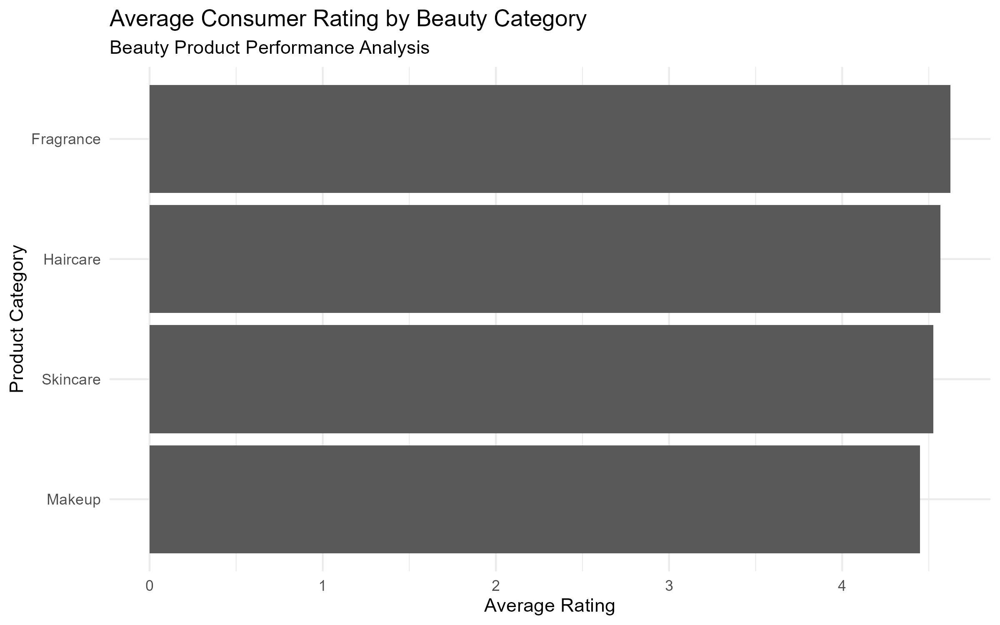
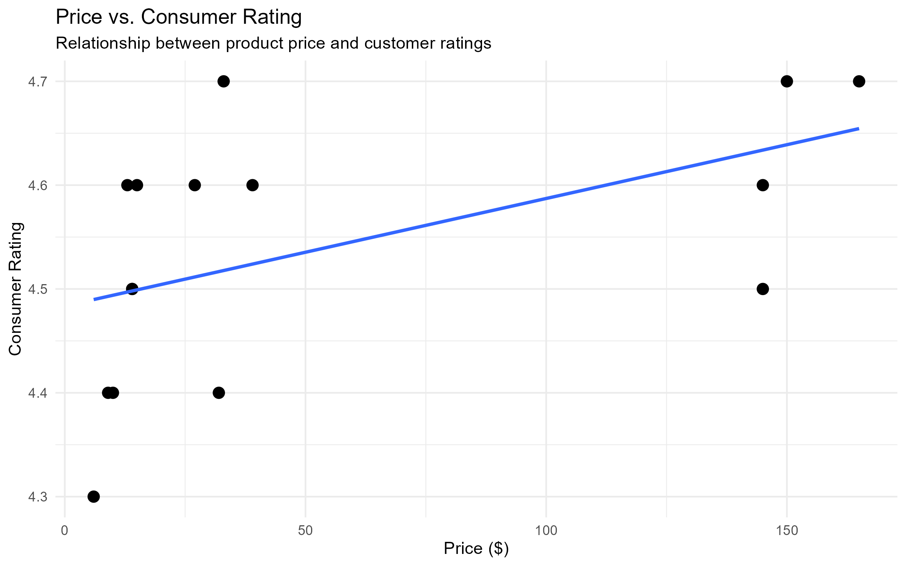
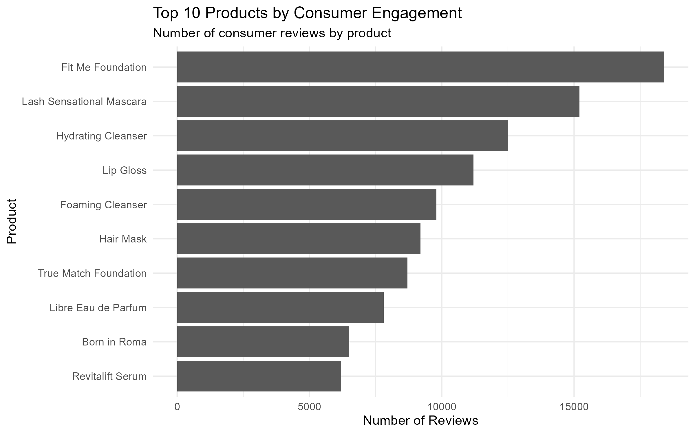

# Beauty Product Performance Analytics

## Project Overview

This project analyzes a sample beauty product dataset to explore consumer ratings, pricing, product categories, and consumer engagement.

The goal is to use data analytics to answer business-focused questions about beauty product performance and demonstrate how data can support product and marketing decisions.

## Business Questions

1. Which beauty product categories have the highest average consumer ratings?
2. Is product price associated with consumer rating?
3. Which products generate the highest levels of consumer engagement?
4. What trends can be identified across beauty product categories?

## Tools Used

- R
- RStudio
- tidyverse
- dplyr
- ggplot2
- Excel

## Analysis

The project includes:
- Data importing and validation
- Missing-value checks
- Descriptive statistics
- Data manipulation and aggregation
- Category-level performance analysis
- Correlation analysis
- Consumer engagement analysis
- Data visualization

## Visualizations

- Average Consumer Rating by Beauty Category
- Price vs. Consumer Rating
- Top 10 Products by Consumer Engagement

## Skills Demonstrated

- R programming
- Data cleaning and validation
- Exploratory data analysis
- Statistical analysis
- Data visualization
- Data storytelling
- Translating data into business insights

## Dataset

This project uses a small sample dataset created for portfolio and educational purposes. It does not represent internal or proprietary data from any beauty company.

## Analysis Visualizations

### Average Consumer Rating by Beauty Category

### Price vs. Consumer Rating

### Top Products by Consumer Engagement

